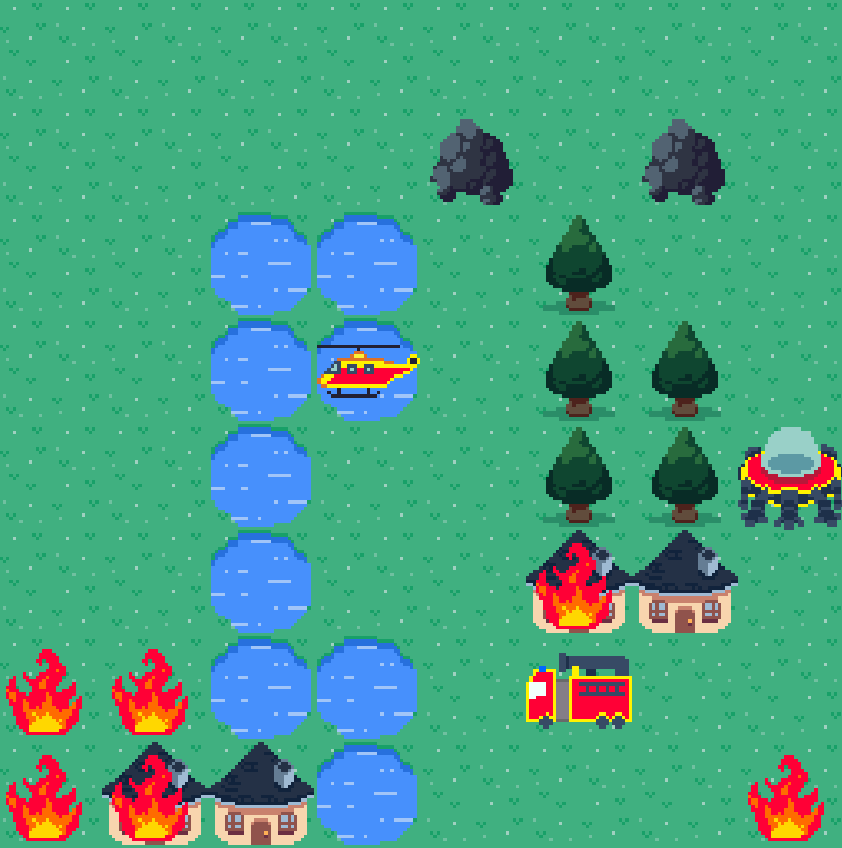
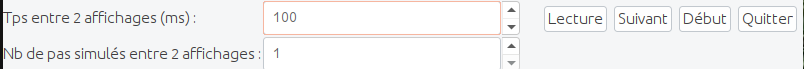

# 🤖🚒 Simulation de robots-pompiers.

Programme de simulation de stratégies pour éteindre des incendies avec des robots-pompiers, réalisé dans le cadre d'un projet de programmation orienté objet à Ensimag (plus de détails sur le programme se trouve dans [sujet.pdf](sujet.pdf)).




## 🧰 Environnement requis
Environnement de programmation Java utilisé (d'autres versions peuvent être compatibles):
- OpenJDK 11.0.24
- Javac 11.0.24

## 🕹️ Test des stratégie

Plusieurs stratégies sont disponibles :
- strategieElementaire
- strategieEvoluee

Pour **compiler et exécuter** la *strategie élémentaire* sur la carte *carte_souhaitée* :

```shell
make testStrategieElementaire carte=cartes/carte_souhaitée
```


Si aucune carte de simulation n’est spécifiée, une carte par défaut est lancée : [cartes/carteSujet.map](cartes/carteSujet.map). 


Les autre cartes disponibles se trouve dans le dossier **carte**.

## 🕹️ Autre tests

Pour tester la lecture des données d'une carte (compilation et exécution):

```shell
make testLecture
```
Pour tester l'exécution d'évenements initiaux (compilation et exécution):

```shell
make testExecutionEvenements:
```


## 🏞️ Interface graphique

Ensuite la fenêtre de simulation contient la barre suivante



### Lecture de la simulation
- **Lecture/Pause** : lis/pause la simulation.
- **Suivant** : Incrémente le pas de la simulation.
- **Début** : Réinitialise la simulation.
- **Quitter** : Quitte l'application.


### Vitesse d'exécution
Pour ralentir/accelerer la simulation, on peut régler : 

- Le temps  entre deux affichages consécutif (en ms).
- Le nombre de pas effectués entre chaque affichage.


